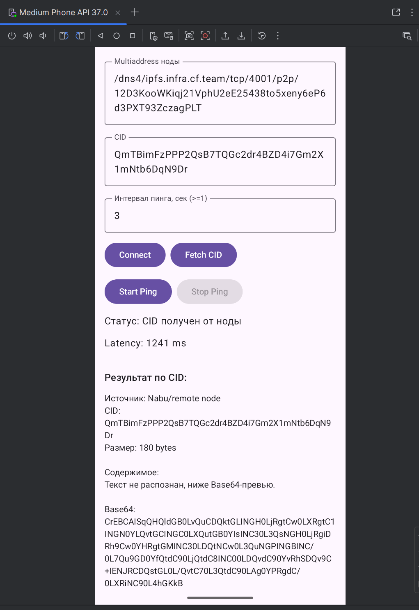

# P2P CID Android App

Тестовое Android-приложение на Kotlin + Jetpack Compose с использованием Peergos Nabu.

## Что умеет

- Подключение к ноде по multiaddress.
- Получение блока по CID.
- Реальный ping ноды по TCP с интервалом (не меньше 1 секунды) и выводом latency в ms.
- Без падений при ошибках сети, timeout и некорректных данных.

## Параметры по умолчанию

- Нода: `/dns4/ipfs.infra.cf.team/tcp/4001/p2p/12D3KooWKiqj21VphU2eE25438to5xeny6eP6d3PXT93ZczagPLT`
- CID: `QmTBimFzPPP2QsB7TQGc2dr4BZD4i7Gm2X1mNtb6DqN9Dr`
- Ping interval: `3` сек

## Как запустить

1. Откройте проект в Android Studio.
2. Дождитесь синхронизации Gradle.
3. Запустите `app` на эмуляторе или устройстве.
4. Нажмите `Connect`.
5. Нажмите `Fetch CID` и дождитесь результата.
6. Для мониторинга задержки нажмите `Start Ping`.

## Интеграционные тесты

- `NodeFlowIntegrationTest.connectAndFetchCid_fromPublicNode`
- `NodeFlowIntegrationTest.pingFailsForInvalidAddress`

## Данные полученные по CID
